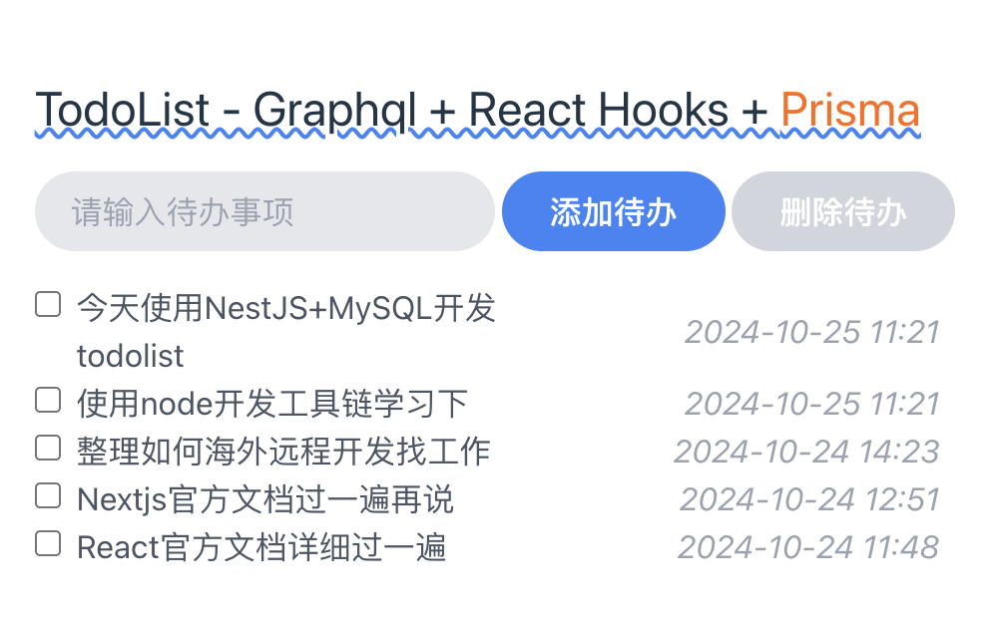

# 🚀todolist
Todolist is min usage of project with your developing learning, and Backend with based Nest.js + Prisma + Graphql, with Vite + React(Hooks) + TailWindCSS, If you intresed, copy it.



## 🌈 Requirements
1. graphql-todolist-backend

- Node 18.16.0+

- Nest.js 10.1.10+

- Prisma 5.21.1+

- graphql 16.9.0+

- MySQL 8.0.27

- @apollo/server 4.11.0+

- @apollo/client 5.21.1+

2. todolist-fe

- Node 18.16.0+

- Tailwindcss 3.4.14+

- Vite 5.4.8+

- Typescript 5.5.3+

- @apollo/client 3.11.8+


## 🛠 Installation
1. git clone repository

```bash
$ git clone https://github.com/Michael2013518/todolist

```

2. install dependencies each project

3. pnpm run start:dev in graphql-todolist-backend

4. npm run dev in todolist-fe

## License

MIT License @2024 Michael Cheung, If any problem, please contact me with email(zdong2010@gmail.com).


